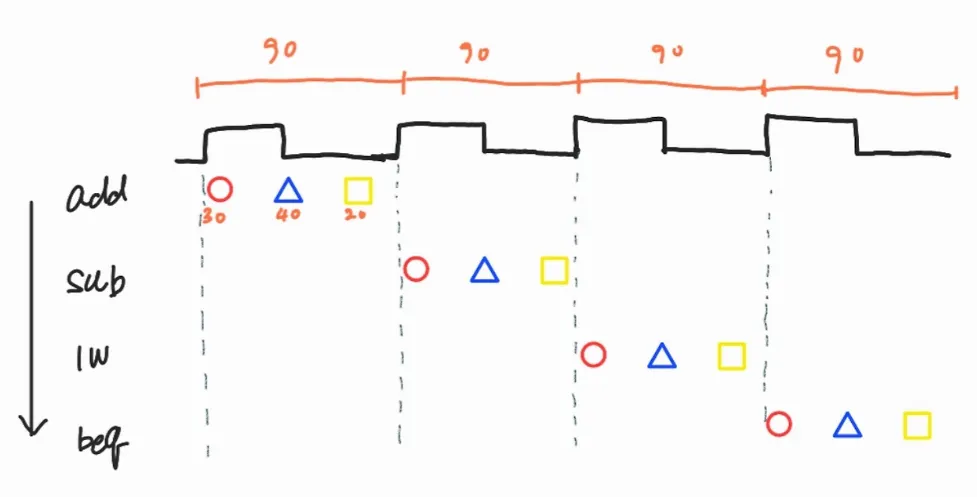
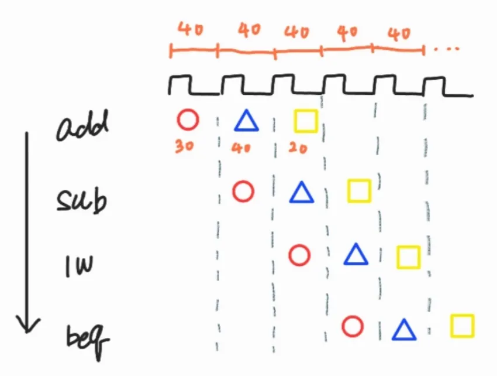

# CPU 구조

CPU(Central Processing Unit)는 **프로그램의 명령어를 해석하고 실행** \
본질적인 역할은 **Instruction Cycle을 반복하는 것**

 

> 다음은 캐시나 파이프라인 등을 제외시키고 단순하게 CPU 내부에서 하나의 명령(Instruction)이 실행되는 과정이다

 

- `Fetch`
    - Memory에 있는 프로그램 데이터를 CPU로 불러오는 작업
- `Decode`
    - CU에서 불러온 명령어를 해석
- `Execute`
    - CU에서 해석한 명령어를 ALU가 연산
- `Write`
    - 결과가 나온 후, 변경된 부분을 저장한다면 다시 Memory로 보내어 기록

 

**CPU는 크게 다음 3가지 핵심 블록으로 구성된다**
- `ALU (Arithmetic Logic Unit, 연산 장치)`
    - CU로 부터 명령을 받아 CPU로 들어온 모든 데이터를 산술, 논리 연산한다
    - ALU에는 연산을 담당하는 가산기, 보수기와 같은 요소들이 있다

- `CU (Control Unit, 제어 장치)`
    - 입력된 명령어를 해독하여 CPU 내부의 움직임을 총괄하고 각 과정을 통제한다
    - 주로 데이터를 Memory로부터 ALU로 옮기라는 명령과, 그 후 다시 Memory로 옮기는 명령을 내린다

- `Registers`
    - CPU 내부에 있는 초고속 메모리로 RAM보다 훨씬 빠르다
    - 크기는 매우 작다
    - CPU가 연산할 때마다 RAM에 접근하면 너무 느리기 때문에, 자주 쓰는 값이나 중간 결과를 Register에 저장하여 활용한다
    - 주요 Register는 다음과 같다

        <table>
            <tr>
                <td>PC (Program Counter)</td>
                <td>다음에 실행할 명령어 주소</td>
            </tr>
            <tr>
                <td>AC (Accumulator)</td>
                <td>누산기, ALU에서 연산된 결과를 임시적으로 저장</td>
            </tr>
            <tr>
                <td>IR (Instruction Register)</td>
                <td>현재 실행 중인 명령어</td>
            </tr>
        </table>
        
        > 이외에도 엄청 많은 레지스터들이 존재한다

 
 

### Pipeline

Pipeline이 없으면, 명령어 하나가 완전히 끝난 후 다음 명령어를 실행하는 Single cycle 구조 \
이로 인하여 CPU 내부 자원이 대부분 놀게 되면서, 처리량이 낮다

 

 

- Pipeline을 통해 작업을 단계로 나누고 겹쳐서 실행하게 된다
- 단일 명령어 처리 시간은 동일하지만, 전체 처리량이 대폭 증가한다

 

 

- Pipeline의 기본 5단계는 다음과 같다
    
    
    | 단계 | 이름 | 역할 |
    | --- | --- | --- |
    | 1 | IF (Fetch) | 명령어 가져오기 |
    | 2 | ID (Decode) | 해석 + Register 읽기 |
    | 3 | EX (Execute) | ALU 연산 |
    | 4 | MEM (Memory) | Memory 접근 |
    | 5 | WB (Write Back) | 결과 저장 |
- 각 단계 사이에는 Pipeline Register가 존재한다
    
    <code>IF ─[ IF/ID ]─ ID ─[ ID/EX ]─ EX ─[ EX/MEM ]─ MEM ─[ MEM/WB ]─ WB</code>
    
    - 각 Pipeline 단계는 동시에 다른 명령어를 처리해야 하므로, 단계 간 데이터에 충돌이 발생할 수 있다
        > IF → ID 에서 IF가 다음 명령어를 가져오는 동안 ID는 이전 명령어를 해석할 때, \
        > 중간 결과를 저장하지 않는다면 데이터가 충돌하는 등의 상황
    - 따라서 Clock 단위로 경계를 명확하게 하기 위해 Pipeline Register가 이 역할을 수행한다
    - 각 Pipeline Register는 1개의 값을 저장하는 것이 아닌, 여러 개의 데이터를 저장한다

 
 

----
### 참고
- [CPU 구조 : 산술논리연산장치(ALU) , CU , 레지스터](https://blog.naver.com/makeflood/222413482401)
- [컴퓨터 구조 single cycle, pipeline 차이 ( cpu동작 순서, Respone time, Throughput, 5-stage 3-stage차이 )](https://wpaud16.tistory.com/entry/%EC%BB%B4%ED%93%A8%ED%84%B0-%EA%B5%AC%EC%A1%B0-single-cycle-pipeline-%EC%B0%A8%EC%9D%B4-cpu%EB%8F%99%EC%9E%91-%EC%88%9C%EC%84%9C-Fetch-Respone-time-Throughput)
- [하루에 하나씩 배우는 컴퓨터 사이언스 개념: CPU 파이프라인 이해](https://yoonhs98.tistory.com/entry/%ED%95%98%EB%A3%A8%EC%97%90-%ED%95%98%EB%82%98%EC%94%A9-%EB%B0%B0%EC%9A%B0%EB%8A%94-%EC%BB%B4%ED%93%A8%ED%84%B0-%EC%82%AC%EC%9D%B4%EC%96%B8%EC%8A%A4-%EA%B0%9C%EB%85%90-CPU-%ED%8C%8C%EC%9D%B4%ED%94%84%EB%9D%BC%EC%9D%B8-%EC%9D%B4%ED%95%B4)