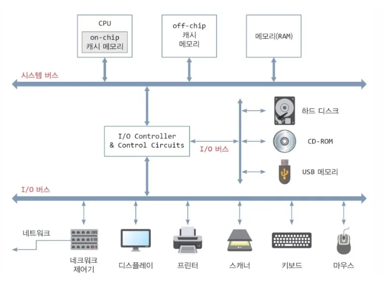
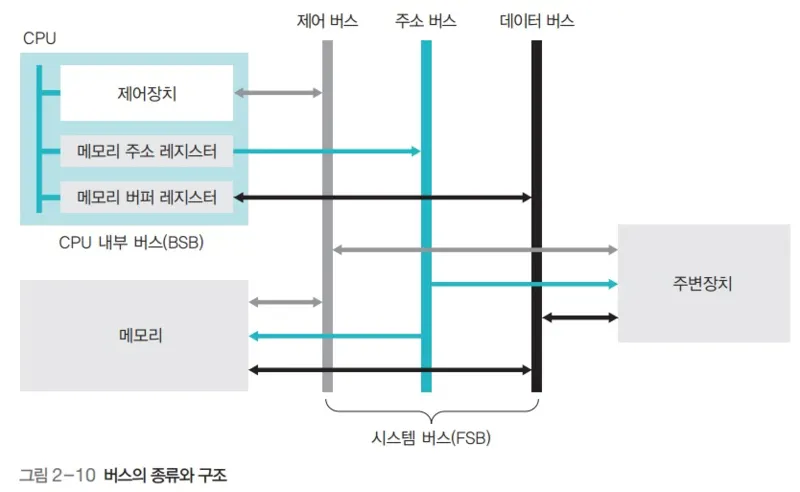

# Bus 개념
Bus는 여러 하드웨어 구성 요소가 **같은 선로(선 집합)를 공유하면서 데이터를 교환**하도록 만든 전기적/논리적 경로
> 💡 메인보드 위에서 CPU, RAM, GPU, SSD 등이 **Bus를 통해 서로 연결**되며, Bus의 대역폭과 동작 속도가 **전체 시스템 성능에 큰 영향을 준다.**

 

 

- System Bus는 **CPU, Memory, I/O Device**들을 서로 이어주는 공용 통로
- CPU ↔ Memory ↔ I/O Device 사이에서 쓰이는 메인 통로이며, **한 번에 한 장치만 이 Bus를 사용할 수 있도록 순서가 조정된다.**
    - Bus Arbitration 메커니즘을 통해 **특정 시점에 하나의 장치만 Bus에 접근할 수 있도록 제한**

 

- System Bus는 다음 3가지 하위 Bus로 구성된다
- `Data Bus`
    - **실제 데이터를 전달하는 양방향 통로**
    - CPU가 Memory에 특정 주소에 있는 데이터를 요청하면, Memory는 그 주소에 있는 데이터를 찾아서 Data Bus를 통해 CPU로 보낸다
    - 이후 CPU가 계산한 결과도 다시 Data Bus를 통해 Memory나 장치로 돌아간다

- `Address Bus`
    - **메모리 주소를 전달하는 단방향 통로**
    - CPU가 메모리의 특정 칸의 데이터를 읽어오도록 요청하면, 해당 주소를 Address Bus를 통해 전달한다
        - CPU → Memory로 흘러가는 단방향 통로
        - Address Bus 선이 32개인지 64개 인지에 따라 최대 메모리 용량이 결정된다
    - Memory나 장치는 Address Bus에서 전달 받은 주소를 통해 해당 주소의 데이터를 Data Bus를 통해 CPU로 전달한다

- `Control Bus`
    - **어떤 작업을 수행할지 신호를 보내는 통로**
    - CPU가 Address Bus로 주소를 보내고, Data Bus로 데이터를 보내면 Control Bus로 쓰기/읽기 처럼 수행할 작업을 보낸다

 

 

System Bus 이외에도 각자 목적에 맞게 설계된 특수한 Bus들도 존재한다
- `I/O Bus`
    - Keyboard, Mouse, Printer 등 느린 장치들을 묶어서 연결하는 Bus
- `PCIe Bus`
    - GPU, NVMe, SSD 등 고속 장치를 연결하는 매우 빠른 Bus
- `USB`
    - 외부 장치를 꽂을 때 쓰는 범용 Bus