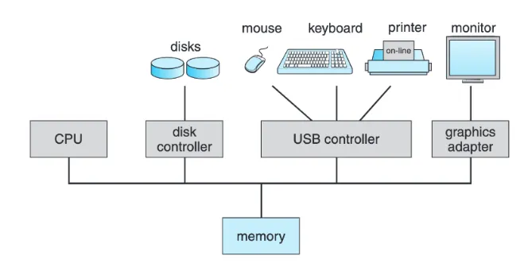

# Computer System 구성

- 현대 범용 컴퓨터 시스템은 하나 이상의 CPU와 여러 구성 요소들과 \
  공유 메모리 사이의 액세스를 제공하는 **Bus를 통해 연결된 여러 장치 컨트롤러로 구성**
- 장치 드라이버는 **특정 하드웨어 장치를 제어하기 위한 커널의 일부분으로 동작하는 프로그램**
- 컴퓨터를 구성하는 다양한 입출력 장치마다 각각 장치 드라이버가 커널에 통합되어 실행

 

 
 

----
### 참고
- [[Operating System - Chapter 1] 운영체제란 무엇인가?](https://imbf.github.io/computer-science(cs)/2020/08/21/What-is-The-Operating-System.html)